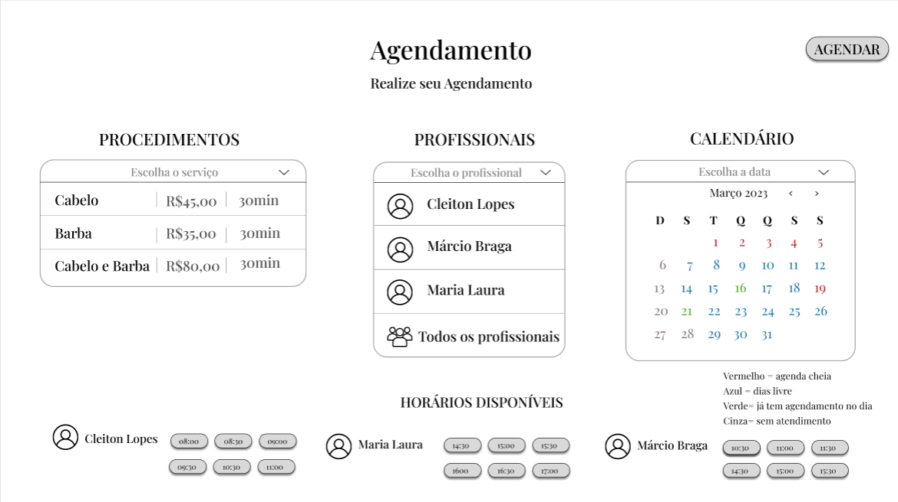
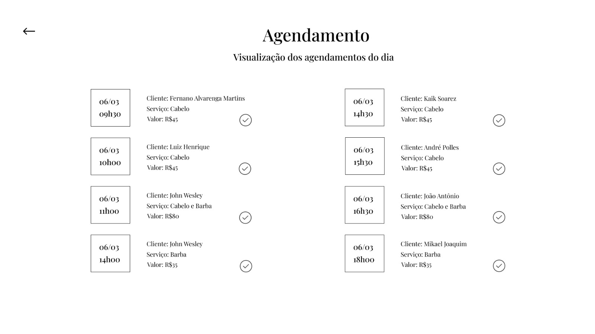
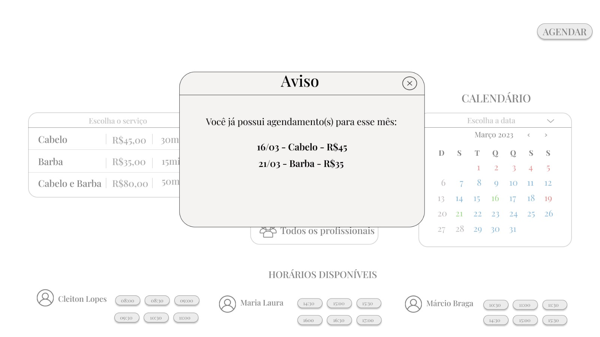

# Aplicação Web para Barbearias

## Membros do grupo:
- <a href="https://github.com/CahAntunes">Camila Antunes</a> - 0030482211017
- <a href="https://github.com/Esdrasmelo">Esdras de Melo Motta</a> - 0030482211003
- <a href="https://github.com/joao-pedro01">João Pedro</a> - 1780482121031
- <a href="https://github.com/JOHNBRITO25">John Wesley Faria de Brito</a> - 0030482211034
- <a href="https://github.com/RJjulia">Júlia Rodrigues</a> - 0030482211021

## Tema do projeto:
O projeto consiste no desenvolvimento de uma aplicação web voltada para o gerenciamento de barbearias. A ideia surgiu a partir da observação da crescente demanda por serviços de barbearia, bem como da necessidade de melhorias nos processos de gestão desses estabelecimentos.

## Resumo do projeto:
Um projeto de aplicação web de gerenciamento de barbearias tem como objetivo principal aprimorar a eficiência e a produtividade das barbearias, além de proporcionar uma melhor experiência para os clientes. A aplicação consiste em um software que será acessado pela internet, permitindo o gerenciamento da maior parte dos aspectos do negócio, desde o agendamento de horários até a gestão financeira, podendo acessar informações de receita diária, semanal e mensal.

A aplicação será desenvolvida com base nas necessidades específicas das barbearias, levando em consideração as particularidades de cada estabelecimento, como os serviços oferecidos por cada barbearia. A aplicação terá como objetivo principal organizar e automatizar os processos, tornando a gestão da barbearia mais eficiente e menos trabalhosa.

Uma das principais funcionalidades do software será o agendamento online, que permitirá aos clientes agendar seus horários diretamente pelo site/aplicação web. Isso reduzirá o tempo gasto com o atendimento telefônico e o agendamento manual, permitindo que a equipe de atendimento se dedique a outras tarefas importantes. Além disso, a aplicação permitirá uma certa "gestão financeira" da barbearia, podendo ver a receita/lucro do dia, semana e mês.

Outras funcionalidades importantes incluem o gerenciamento de funcionários, onde será possível cadastrar e lidar com funcionários através do sistema. O funcionário poderá ver seus atendimentos do dia e quantos atendimentos foram feitos, por exemplo. Com o gerenciamento de funcionários, o proprietário poderá ter um controle maior sobre a equipe, garantindo que haja um número suficiente de funcionários disponíveis em horários de maior movimento.

A aplicação será desenvolvida com tecnologias de ponta e muito utilizadas atualmente, consistindo basicamente em Javascript e suas tecnologias e bibliotecas disponíveis. Isso garantirá uma interface amigável e uma experiência de uso intuitiva para os usuários da aplicação.

A utilização da aplicação web traz inúmeras vantagens para as barbearias, como a possibilidade de acessar o software de qualquer lugar, a redução de custos com a manutenção de servidores locais e a escalabilidade, permitindo que a aplicação possa ser utilizada por um grande número de barbearias sem comprometer o desempenho.

Em resumo, o projeto de aplicação web de gerenciamento de barbearias tem como objetivo principal aprimorar a eficiência e a produtividade das barbearias, além de proporcionar uma melhor experiência para os clientes. Com funcionalidades como agendamento online, gestão financeira, gerenciamento de funcionários, a aplicação permitirá que os proprietários de barbearias se dediquem mais às atividades que realmente importam e tomem decisões mais precisas, garantindo o sucesso do negócio e proporcionando uma melhor experiência para o cliente, proprietário e também para os funcionários (barbeiros). Com essa ferramenta, a gestão de uma barbearia se torna muito mais eficiente e descomplicada, permitindo que o estabelecimento possa crescer e se destacar em um mercado cada vez mais competitivo.
 
## Tecnologias

<h3>Front-end</h3>
<ul>
<li>HTML</li>
<li>CSS</li>
<li>JavaScript</li>
<li>Bootstrap</li>
<li>React.js</li>
</ul>

<h3>Back-end</h3>
<ul>
<li>Node.js</li>
<li>Typescript</li>
<li>Express.js</li>
<li>GraphQL</li>
<li>Prisma.io (ORM)</li>
</ul>

<h3>Banco de Dados (relacional)</h3>
<ul>
<li>MySQL</li>
</ul>

<h3>Ferramentas e Tecnologias</h3>
<ul>
<li>Vs Code</li>
<li>Git</li>
<li>GitHub</li>
<li>dbdiagram.io</li>
<li><a href="https://www.figma.com/file/uG8qZ9EWqx1LUCFbViWIly/Untitled?node-id=0-1&t=ZHjqJ2QOLUHnpBF7-0">Figma<a/></li>
<li>Swagger</li>
</ul>

## Telas do projeto
 
<h3>Tela agendamento do cliente</h3>

 
<h3>Tela agendamento do profissional</h3>

 
<h3>Tela de aviso caso já tenha horário marcado</h3>

## Observações do Professor - 20/03/2023:
- Adicionar legenda abaixo ou próximo ao calendário informando sobre o que se refere cada cor aos quais os dias estão pintados;
- Averiguar um valor "interessante"/viável para a mensalidade da aplicação, visto que a aplicação será cobrada via mensalidade;
- Averiguar quantas assinaturas mensais são necessárias para que a empresa fique em uma situação financeira "saudável";
- Definir um modelo/plano de negócio para que seja possível definirmos questões técnicas, como armazenamento, interfaces etc.

## Link do Protótipo
https://www.figma.com/file/uG8qZ9EWqx1LUCFbViWIly/Untitled?node-id=0-1&t=ZHjqJ2QOLUHnpBF7-0

## Link do plano de negócios

<a href="https://fatecspgov-my.sharepoint.com/:w:/g/personal/joao_pedro_fatec_sp_gov_br/Ee8UtrFEqMBGomkQMLqgL48B4Gl6fDiTwgJsMgygI8-Q0A?rtime=C_x4SEU_20g">Plano de negocios</a>

## Diagrama de caso de uso

## Jornada do Usuário 
<h3>Persona 1: Administrador </h3>
<h4>Identificação da Persona </h4>
<li>	Nome: Claudio </li>
<li>	Idade: 37 anos </li>
<li>	Localização: Sorocaba</li>
<h4>	Características Demográficas  </h4>
<li>	Profissão: Proprietário de uma rede de barbearias, com sedes no bairro do Campolim, no Centro e no bairro Santa Rosália </li>
<li>	Estado civil: Casado </li>
<h4>	Descrição Comportamental </h4> 
<li>	Personalidade: Claudio é responsável e dedicado, que valoriza a qualidade dos serviços oferecidos pela a sua rede de barbearias. Ele é organizado e busca sempre otimizar seus recursos para maximizar os seus lucros e a satisfação de seus clientes. Claudio está sempre em busca de novidades e tendências do mercado de beleza masculina para oferecer serviços inovadores em sua rede</li>
<h4>	Necessidades e Desafios </h4>
<li>	Os funcionários de Claudio estão relatando uma certa dificuldade para gerenciar os agendamentos do dia de cada unidade da rede </li>
<h4> Link: </h4>
<a href = "https://www.figma.com/file/uG8qZ9EWqx1LUCFbViWIly/Untitled?type=design&node-id=313-1496&t=KoVZJ92ps1mIMH5M-4" > Jornada do Usuário Administrador </a>
 

 
<h3> Persona 2: Cliente Fiel </h3>
<h4>	Identificação da Persona </h4>
<li> Nome: Fernando </li>
<li>	Idade: 23 anos </li>
<li>	Localização: Sorocaba </li>
<h4>	Características Demográficas </h4> 
<li> Profissão: Publicitário </li>
<li>	Estado civil: Solteiro </li>
<h4>	Descrição Comportamental </h4>
<li>	Personalidade: Fernando é uma pessoa que gosta de cuidar de sua aparência. É uma pessoa que leva o seu trabalho a sério e acredita que a sua imagem interfere diretamente nele </li>
<h4>	Necessidades e Desafios</h4>
<li>	Fernando é um cliente fiel, todas as semanas ele vai à barbearia e busca mais praticidade para isso </li>
<h4> Link: </h4>
<a href = "https://www.figma.com/file/uG8qZ9EWqx1LUCFbViWIly/Untitled?type=design&node-id=313-1496&t=KoVZJ92ps1mIMH5M-4" > Jornada do Usuário Cliente Fiel </a>
 

 
<h3>Persona 3: Novo Cliente </h3>
<h4>	Identificação da Persona </h4>
<li>	Nome: Carlos </li>
<li> Idade: 28 anos </li>
<li>	Localização: Sorocaba </li>
<h4>	Características Demográficas </h4> 
<li> Profissão: Enfermeiro </li>
<li>	Estado civil: Casado </li>
<h4>	Descrição Comportamental </h4>
<li> Personalidade: Fernando é dedicado à sua família e ao seu trabalho, e gosta de sempre bem com a sua autoestima </li>
 <h4>	Necessidades e Desafios </h4>
<li>	Certo dia sua esposa fala que seus cabelos e sua barba estão muito grandes e que seria melhor ele ir à uma barbearia, mas Carlos e sua esposa residem a pouco tempo na cidade de Sorocaba, portanto Carlos não conhece nenhuma barbearia </li>
<h4> Link: </h4>
<a href = "https://www.figma.com/file/uG8qZ9EWqx1LUCFbViWIly/Untitled?type=design&node-id=313-1496&t=KoVZJ92ps1mIMH5M-4" > Jornada do Usuário Cliente Novo</a>
 
 

## Link do Diagrama de Classes e Caso de Uso
O link abaixo te redirecionará para uma página do Google Drive onde no topo da página terá uma opção "Abrir com" ou "Open with". Clicando nessa opção, aparecerá a opção de abrir o diagrama no site em que ele foi feito.
Recomendamos seguir esse passo a passo e abrir o diagrama direto no site em que ele foi feito, pois por algum motivo a imagem de pré-visualização não está com uma boa definição, fazendo-se necessário abrir diretamente no site de origem.
 
 
<a href="https://drive.google.com/file/d/1yx8a2BfDlGu9XkvZa6Vfwn5GivfhHM0J/view?usp=sharing](https://viewer.diagrams.net/?tags=%7B%7D&highlight=0000ff&edit=_blank&layers=1&nav=1&title=Diagrama%20Caso%20de%20uso#Uhttps%3A%2F%2Fdrive.google.com%2Fuc%3Fid%3D1yx8a2BfDlGu9XkvZa6Vfwn5GivfhHM0J%26export%3Ddownload)https://viewer.diagrams.net/?tags=%7B%7D&highlight=0000ff&edit=_blank&layers=1&nav=1&title=Diagrama%20Caso%20de%20uso#Uhttps%3A%2F%2Fdrive.google.com%2Fuc%3Fid%3D1yx8a2BfDlGu9XkvZa6Vfwn5GivfhHM0J%26export%3Ddownload">Diagrama Caso de Uso e Classes</a>
 
 
## Documento de Concepção

<strong>Link:</strong> <a href="https://fatecspgov-my.sharepoint.com/:w:/g/personal/john_brito_fatec_sp_gov_br/EXgi2-p2KYhOv-bjtT8SIW4Bp5MpFVnV0CPKgDP1S6g86A?e=8icbUx">Documento online</a>
